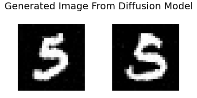
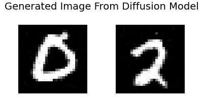
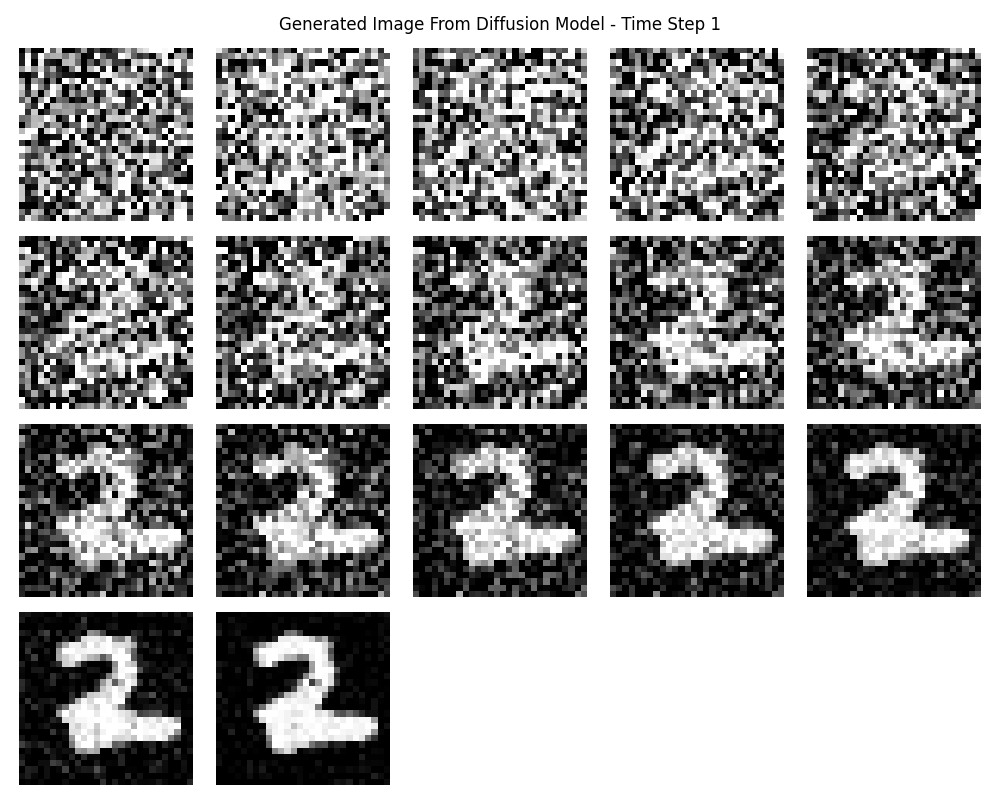

# Diffusion Model Implementation

A comprehensive implementation of Denoising Diffusion Probabilistic Models (DDPM) with an interactive command-line interface for training and generating images from multiple datasets.

## 🏗️ Architecture

The model implements a U-Net architecture specifically designed for diffusion models:

- **Encoder-Decoder Structure**: Symmetric downsampling and upsampling paths
- **Residual Blocks**: ResNet-style blocks with time embedding injection
- **Self-Attention**: Applied at dataset-specific resolutions for global coherence
- **Skip Connections**: Feature concatenation between encoder and decoder
- **Time Embeddings**: Sinusoidal positional encoding for diffusion timesteps
- **Configurable Channels**: Base channels: 128, dataset-adaptive multipliers

## 🛠️ Installation

1. Clone the repository:
```bash
git clone <repository-url>
cd DiffusionModel
```

2. Create and activate a virtual environment:
```bash
python -m venv .venv
source .venv/bin/activate  # On Windows: .venv\Scripts\activate
```

3. Install dependencies:
```bash
pip install -r requirements.txt
```

4. Create necessary directories (automatically created on first run):
```bash
mkdir -p data models output
```

## 📊 Generated Samples







## 🚀 Usage

### Quick Start

Run the interactive interface:
```bash
python main.py
```

### Main Menu Options

1. **Train Model** - Train the diffusion model on selected dataset
2. **Generate Images** - Create new images using trained model  
3. **Load Model** - Load previously saved model checkpoints
4. **Choose Dataset** - Switch between MNIST, CIFAR-10, CIFAR-100, CelebA
5. **Make Transformation** - Configure image preprocessing (currently disabled)
6. **Save Model** - Save current model state
7. **Training Config** - Display current configuration
8. **Change Device** - Switch between CPU, CUDA, MPS
9. **Set Hyperparameters** - Adjust training parameters
10. **Get Context** - Display comprehensive help and quick guide
11. **New Model** - Create fresh model instance

### Recommended Workflow

1. **Choose Dataset** (Option 4): Select MNIST for quick testing
2. **Set Device** (Option 8): Use CUDA/MPS if available
3. **Configure Hyperparameters** (Option 9): Adjust epochs, batch size
4. **Train Model** (Option 1): Train with checkpointing enabled
5. **Generate Images** (Option 2): Create new samples
6. **Save Model** (Option 6): Preserve trained weights

## 📁 Project Structure

```
DiffusionModel/
├── main.py                    # Interactive CLI interface
├── src/
│   ├── __init__.py
│   ├── config.py             # Configuration and hyperparameters
│   ├── modified_Unet.py      # U-Net model architecture
│   ├── diffusion.py          # Training and inference functions
│   ├── utils.py              # Utility functions (save/load, visualization)
│   └── datasets.py           # Dataset loading functions
├── models/                   # Saved model checkpoints (.pth/.pt)
├── output/
│   ├── clear/               # Final generated images
│   └── grid/                # Grid visualizations with progress steps
├── data/                    # Downloaded datasets (auto-created)
├── .venv/                   # Virtual environment
├── requirements.txt         # Python dependencies
└── README.md               # This file
```

## 🎯 Supported Datasets

| Dataset | Image Size | Channels | Classes | Architecture Config |
|---------|------------|----------|---------|-------------------|
| MNIST | 28×28 | 1 | 10 | ch_mult: [1,2,2], attn: [14,7] |
| CIFAR-10 | 32×32 | 3 | 10 | ch_mult: [1,2,2,2], attn: [16,8] |
| CIFAR-100 | 32×32 | 3 | 100 | ch_mult: [1,2,2,2], attn: [16,8] |
| CelebA | 64×64 | 3 | - | ch_mult: [1,2,2,2,4], attn: [32,16,8] |

Each dataset automatically configures appropriate transforms and model architecture.

## ⚙️ Configuration

### Default Hyperparameters

- **Epochs**: 1 (adjustable)
- **Batch Size**: 32
- **Learning Rate**: 2e-4
- **Diffusion Steps (T)**: 500
- **Dropout Rate**: 0.1
- **Residual Blocks**: 2
- **Base Channels**: 128
- **Beta Schedule**: Cosine

### Device Support

Automatically detects and supports:
- **CUDA**: NVIDIA GPU acceleration
- **MPS**: Apple Silicon acceleration  
- **CPU**: Universal fallback
- **Memory Management**: CUDA cache clearing and expandable segments

## 🧠 How It Works

### Forward Process (Training)
1. Add Gaussian noise to real images over T timesteps
2. Train U-Net to predict noise at each timestep
3. Use cosine beta schedule for stable training

### Reverse Process (Generation)
1. Start with random noise
2. Iteratively denoise using trained model
3. Generate new images through learned reverse process

## 🔧 Features

### Training
- **Checkpointing**: Save models during training
- **Loss Tracking**: Monitor training progress
- **Validation**: Optional test set evaluation
- **Progress Visualization**: Real-time loss curves

### Generation
- **Batch Generation**: Create multiple images
- **Grid Visualization**: See denoising progress steps
- **Custom Naming**: Save images with custom filenames
- **Progress Steps**: Configurable visualization intervals

### Model Management
- **Save/Load**: Flexible model persistence (.pth/.pt)
- **Architecture Adaptation**: Auto-configure for datasets
- **Memory Optimization**: CUDA memory management

## 💡 Quick Tips

- **Start with MNIST** for fast prototyping (28×28, 1 channel)
- **Use GPU acceleration** for faster training
- **Enable checkpointing** for long training sessions
- **Monitor memory usage** with larger datasets
- **Experiment with T steps** (fewer = faster, more = higher quality)

## 📚 Technical Details

- **Noise Schedule**: Cosine beta schedule (stable training)
- **Architecture**: Time-conditional U-Net with attention
- **Optimization**: Adam optimizer with 2e-4 learning rate

---
## References
- Tutorial by Michael Wornow - https://michaelwornow.net/2023/07/01/diffusion-models-from-scratch
- Denoising Diffusion Probabilistic Models" by Ho et al - https://arxiv.org/abs/2006.11239